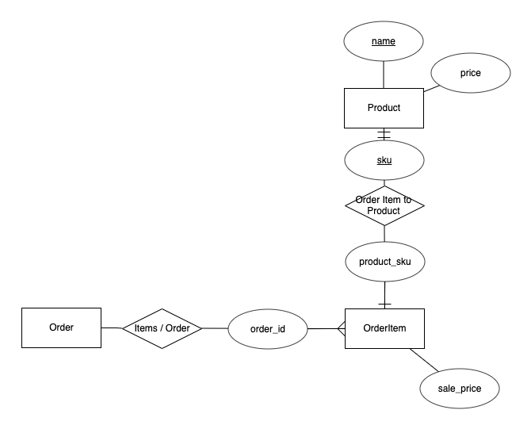

# ACME Widget Co Sales Total Calculator

## Requirements

If you have docker installed on your machine you can run `docker-compose up` to run this project & its included tests

If you don't wish to use Docker you will require:
- php 7.3
- Composer

Simply run `composer install` in this directory, then `./vendor/bin/phpunit` to run the included tests. 
The `./tests/fixtures` folder contains the data specified in the task.

## Tasklist
- [x] Create git repository, initialize composer project and add initial ERD
- [x] Write test harness
- [x] Implement initial interface for required basket methods
- [x] Implement Entity Models
- [x] Implement Basket
- [x] Finish off documentation

## Assumptions
- All data coming in via fixtures is valid, thus no validation of data structure is required
- That special offers are all Buy X Product and get X off
- That special cannot stack, once a valid special offer has been found it is applied and the process stopped
- For production use the Delivery cost system would want to be built in a more robust manner

## Other
- ERD: 